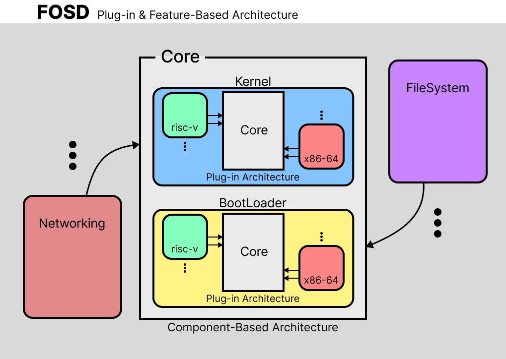

# FOSD Architecture

This document pertains to the software architecture design of the FOSD project. It will be highly beneficial to have a foundational understanding of this document before contributing to the FOSD project or analyzing its source code.

From a software design perspective, the architecture of FOSD has been designed to **enhance extensibility and flexibility within the framework**. Overall, it increases extensibility by appropriately integrating **Plug-in Architecture and Feature-Based Architecture**.

Following the design of the Plug-in Architecture, **the Core, which is positioned accordingly, follows a Component-Based Architecture** and includes the Kernel and BootLoader.

Recursively, **each component further emulates the overall Plug-in Architecture structure**, allowing it to handle **various system architectures beyond x86-64, such as RISC-V**.